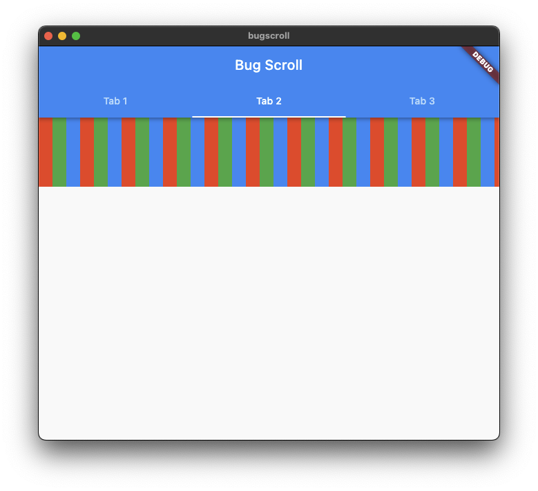

# bug scroll

The ListView with its scrollDirection set as Axis.horizontal inside a TabBarView
is not scrolling on macos, it is working as expected on iOS and Android; I did
not check on Linux and Windows yet.

## Steps to Reproduce

1. Run the app on macos
2. Click on any tab
3. Try to scroll the ListView
4. It is not scrolling

## Screenshots

